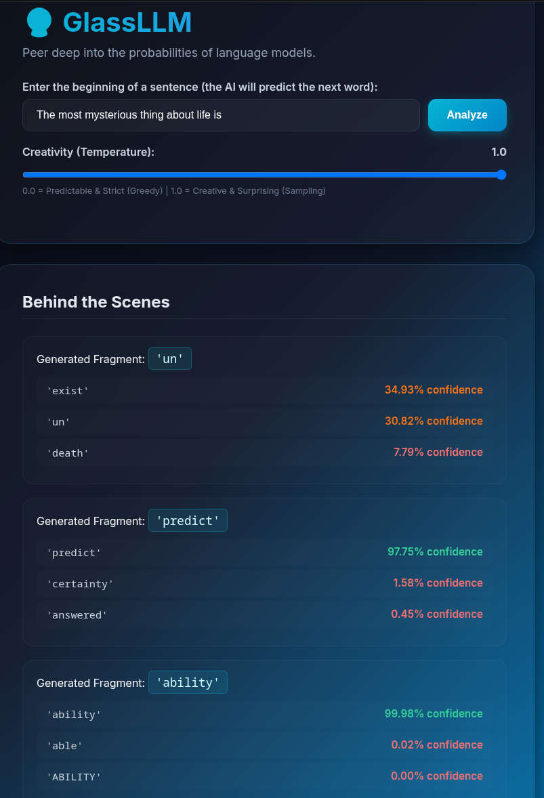

# GlassLLM 🔮

### Peer deep into the probabilities of language models.

A Flask-based web application designed to visualize the internal token prediction mechanics of LLMs. This project was built as the Final Project for **Harvard's CS50x**.

#### 🎥 Video Demo: <YOUTUBE-LINK >

---

## 📸 Screenshots


### The Interactive Dashboard

Here you can see the core user interface where sentences are analyzed, showing the top 3 alternative tokens for each generation step with an adaptive color-coded confidence score:



By adjusting the Temperature slider, users can see how the model's base token probabilities remain constant, but the generation changes from predictable (Greedy Search at 0.0) to creative (Sampling at 1.0)

---

## 📝 Description

**GlassLLM** is an educational tool that illustrates how LLMs choose their words. GlassLLM reveals the underlying mathematical probabilities behind every token generated.

### Why I Built This

During my journey in CS50, I became fascinated by how large language models predict the next word based on probability distributions. I wanted to build an intuitive interface that allows anyone to visualize these probabilities in real-time, making concepts like `logprobs` and `temperature` easy to understand.

---

## ✨ Features

- **Real-Time Tokenization Breakdown:** Displays exactly how the API splits the generated text into individual sub-word fragments.
- **Top 3 Alternatives Visualizer:** For every generated token, the app fetches and displays the top 3 alternative words the model considered at that exact moment.
- **Logprob-to-Percentage Conversion:** Converts complex logarithmic values (`logprobs`) from the OpenAI API into reader-friendly percentage scores using advanced mathematical conversions ($e^{logprob} \times 100$).
- **Dynamic Glassmorphism UI:** UI designed with frosted-glass cards and clean typography.
- **Interactive Creativity Control:** Features a live HTML/JavaScript `temperature` slider that controls the sampling behavior of the GPT-4o-mini model.
- **Smart Color Coding:** Automatically applies an "input traffic light" system to probabilities (Green for $\ge 90\%$, Light Green for $\ge 50\%$, Orange for $\ge 10\%$, Red for low confidence) using Jinja2 template logic.

---

## 📁 File Structure

- `app.py`: The core Flask application containing the backend route handlers, input validation, and OpenAI API integration.
- `templates/index.html`: The frontend template utilizing Jinja2 loops and conditionals to structure the dashboard and dynamically inject data.
- `static/style.css`: Custom CSS containing the glassmorphic styling, animations, and color scheme.
- `.env.example`: A template file showing the required environment variables without exposing sensitive API keys.
- `.gitignore`: Configured to ensure the virtual environment (`venv/`) and the secret `.env` file are never pushed to GitHub.

---

## 🛠️ Installation & Setup

To run GlassLLM locally on your machine, follow these steps:

1. **Clone the repository:**

   ```bash
   git clone https://github.com/krumbeck/glassllm.git
   cd glassllm

   ```

2. **Create and activate a virtual environment:**

   ```bash
   python -p venv venv
   source venv/bin/activate  # On Windows use: venv\Scripts\activate

   ```

3. **Install the dependencies:**

   ```bash
    pip install flask openai python-dotenv

   ```

4. **Set up your Environment Variables:**
   - Duplicate the .env.example file and rename it to .env
   - Open .env and paste your own OpenAI API key here:

   ```bash
    OPENAI_API_KEY=your_actual_api_key_here

   ```

5. **Run the application:**

   ```bash
    python app.py

   ```

   Open your browser and navigate to http://127.0.0.1:5000/.
